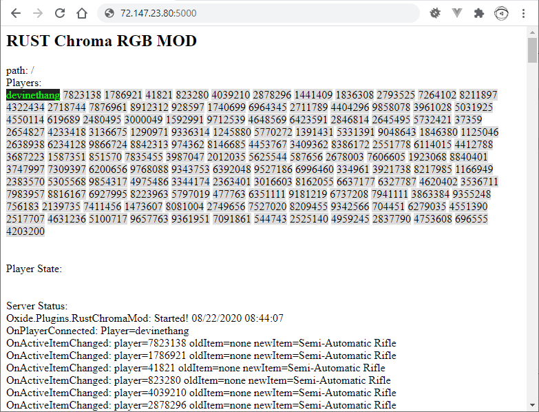

# Overview

This is the Chroma RGB Mod server for RUST. This allows a RUST client to control Chroma RGB lighting on Windows. The server runs a mod and a client app (on Windows) handles displaying the lighting.

You can find the Chroma RGB Mod client for RUST [here](https://github.com/tgraupmann/Cpp_RustChromaModClient).

# Guide

## Server Setup

### SteamCMD

* Setup [SteamCMD](https://developer.valvesoftware.com/wiki/SteamCMD)

**Windows**

* Download [SteamCMD](https://steamcdn-a.akamaihd.net/client/installer/steamcmd.zip)

* Unpack to `C:\steamcmd`

* Run `steamcmd` on the command-line to setup.

```
cd C:\steamcmd
steamcmd
```

**SteamCMD Login Anonymous**

To download most game servers, you can login anonymously.

```
login anonymous
```

### RUST

* Setup the [RUST Dedicated Server](https://developer.valvesoftware.com/wiki/Rust_Dedicated_Server)

* Log in with a Steam account or anonymously: `login username` or `login anonymous`

* Use a valid install folder (use the fullpath): `force_install_dir C:\steamcmd\steamapps\rust_server`

* Run: `app_update 258550` validate to download the public branch of rust dedicated server

* Exit steamcmd with `exit`

### Run the RUST - Dedicated Server

* Extract [Oxide.Rust.zip](https://umod.org/games/rust) to `C:\steamcmd\steamapps\rust_server`

* Launch the RUST dedicated server:

```
cd "C:\steamcmd\steamapps\rust_server\"
RustDedicated.exe -batchmode +server.ip 0.0.0.0 +server.port 28015 +server.tickrate 10 +server.hostname "RUST Chroma Mod" +server.identity "dev_rust_chroma_mod" +server.seed 793197 +server.maxplayers 50 +server.worldsize 3000 +server.saveinterval 600 +rcon.ip 0.0.0.0 +rcon.port 28016 +rcon.password "Your_Rcon_Password" -logfile "logfilename.log"
```

* Exit the dedicated server with `Control` + `C`

## Create the Chroma RGB Mod

* [Getting Started with uMod](https://umod.org/documentation/getting-started)

* [Universal Events](https://umod.org/documentation/games/universal#unload)

* [RUST Events](https://umod.org/documentation/games/rust)

## Setup

* Copy [RustChromaMod.js](oxide/plugins/RustChromaMod.js) to `C:\steamcmd\steamapps\rust_server\oxide\plugins`

* Copy [RustChromaMod.cs](oxide/plugins/RustChromaMod.cs) to `C:\steamcmd\steamapps\rust_server\oxide\plugins`

* Copy Chroma Animations from [Animations](oxide/plugins/Animations) to `C:\steamcmd\steamapps\rust_server\oxide\plugins\Animations`

* Disable sandbox: Create an empty text file `C:\steamcmd\steamapps\rust_server\RustDedicated_Data\Managed\oxide.disable-sandbox`

* Relaunch the dedicated RUST server


## Admin

* Get your 64-bit Steam id or look it up - [steamidconverter.com](http://steamidconverter.com/)

* Create a text file at `C:\steamcmd\steamapps\rust_server\server\dev_rust_chroma_mod\cfg\users.cfg`

* Add the admin entry:

```
ownerid "64_bit_steam_id" "optional_user_name" "optional_reason"
```

## Run RUST - Game Client

* On the main menu open the console with `F1`

* Connect to the dedicated server (method 1):

**Note: Localhost didn't want to connect in the case you try to run a dedicated server and client on the same machine, that didn't work.**

```
connect <SERVER_IP_ADDRESS>:28015
```

* Connect to the local server (method 2):

```
client.connect <SERVER_IP_ADDRESS>:28015
```

## Razer Chroma RGB

* In order to see Chroma RGB events, Install [Synapse and the Chroma Connect module](https://www.razer.com/synapse-3)

* Open the browser on the server mod page default port 5000. [http://SERVER_IP_ADDRESS:5000](http://localhost:5000)

* Be aware that you may have to update firewall rules to allow HTTP traffic on your selected port

* Select the player username to see Chroma RGB events for that player

* Clicking the player username will highlight in a different style



* Pay no attention to the look of the thing, the web UI hasn't been skinned. Instead look at your surronding hardware and/or your stream overlays!

* Even better, if you are streaming, send your [Chroma RGB events to your viewers](https://www.microsoft.com/store/apps/9PG8DNKL06M6)

### Chroma Events

* Idle animation - show hotkeys when no other events are happening

* Blink White - player jump/swim

* Duck sprite - player duck

* Top down scrolling bars - player sprint

* Attack animation - when player hits something

* Sliding cyan bars - switch active items

* Blink Red - can't afford to place!

* Gray/Cyan - player connect

* Dark green/dark red - player death
